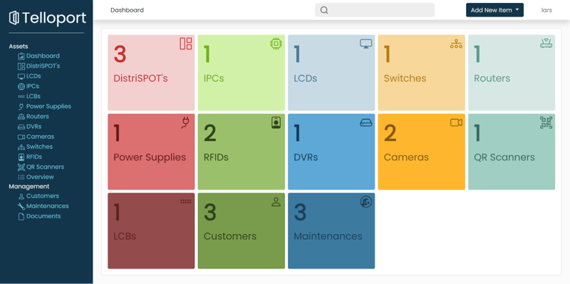
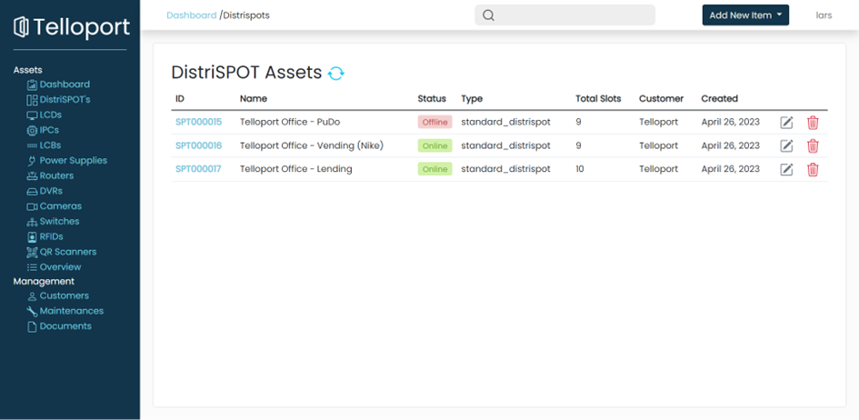
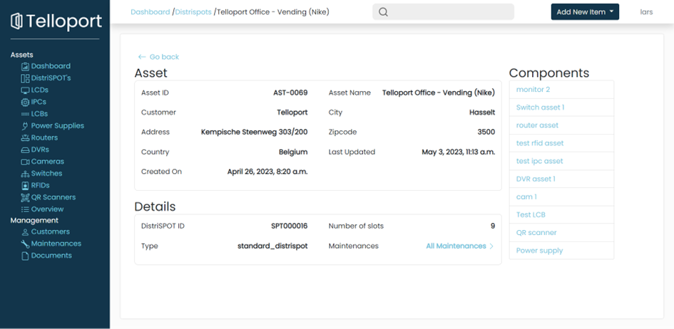
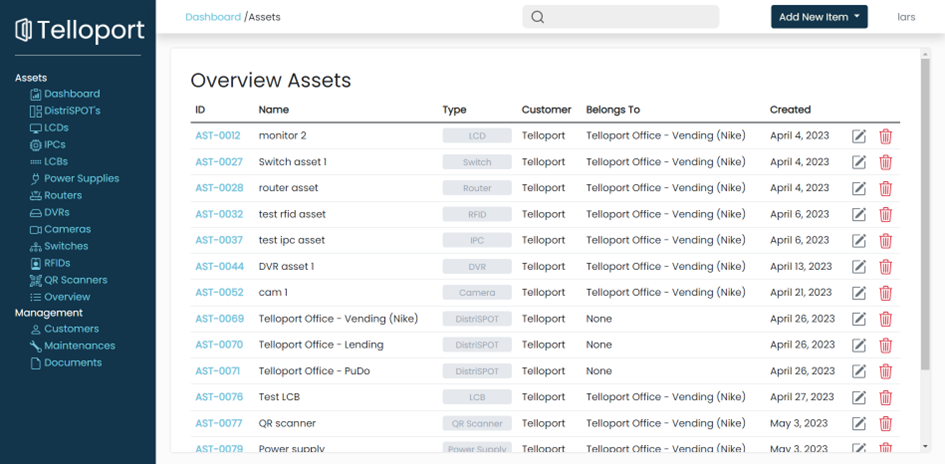
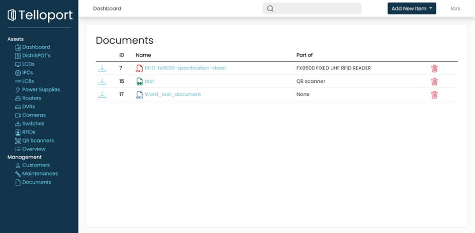
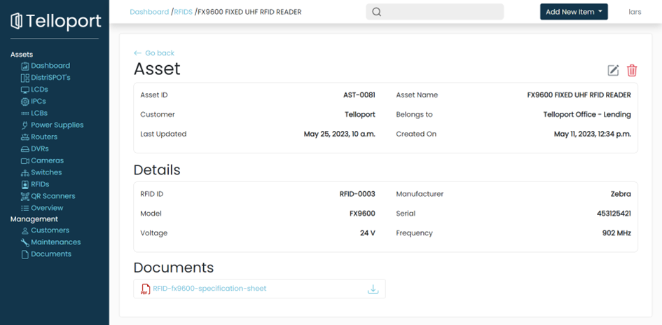

# cmdb-django

During my internship, I had the opportunity to work on building a CMDB system that serves as a centralized repository for storing and managing information related to hardware, software, and other IT assets. This project is a result of my hard work and dedication to creating a reliable and user-friendly CMDB solution.

